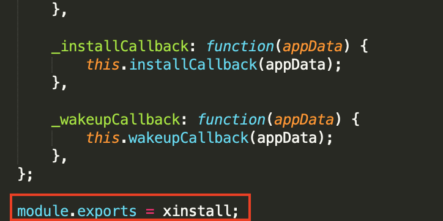
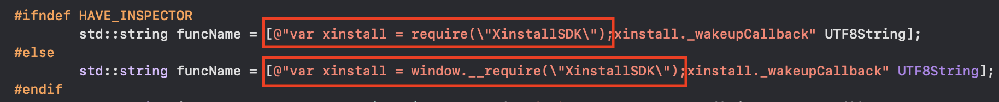
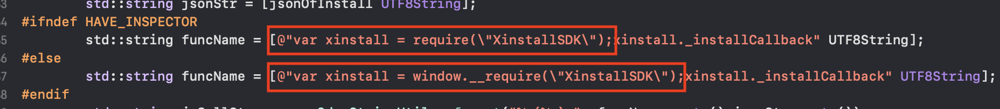
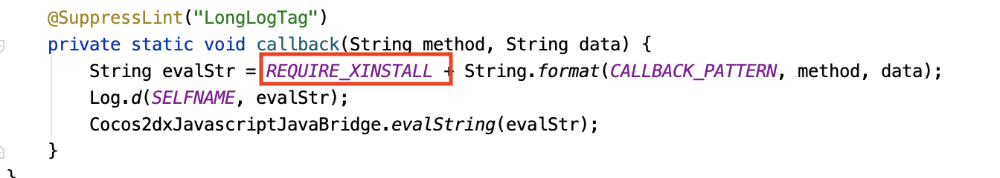

# Cocos2dx-js  集成

直接通过Cocos2dx-js 生成的项目需要做一下修改

### 一、 脚本修改

删除 `XinstallSDK.js`文件中的模块导入语句可以删除



1. 将`XinstallSDK.js`加入工程后，不再需要使用

   ```javascript
   var xinstall = require("XinstallSDK");
   ```

2. 将 `XinstallSDK.js` 加入 `project.json` 的 `jsList` 数组中

### 二、 iOS文件修改

在 `XinstallJSBridge.mm`文件中将回调语句中的 `require 语句`去除





### 三、Android文件修改

将`XinstallCocos2dxJSHelper.java`文件内的require 语句去除



