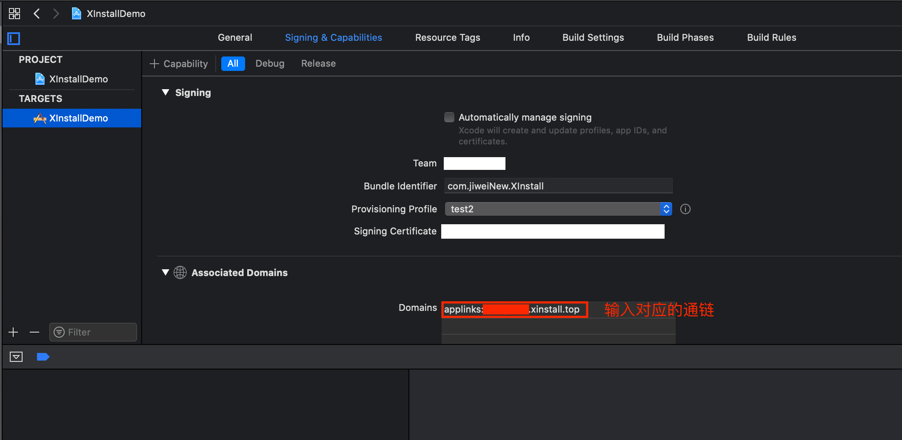

# Cocos Creator Cocos2dx JS 接入文档

此文档是为Cocos Creator 集成而写，直接使用cocos2d-js 用户需要进行相关更改再集成，具体可以参考[Cocos2dx-js集成适配](https://github.com/xinstall/Xinstall-cocos2dx-SDK/blob/main/JavaScriptSDK/Cocos2d-js/Cocos2dx-js集成.md)

## iOS 集成

### 一、 导出工程

1. 在选择**Cocos Creator**菜单`项目`->`构建发布` 后的**弹框中**，将发布平台选择为`iOS`,并填写其他相关配置，最后点击`构建`。

2. 在`构建`执行结束后,使用**Xcode**打开`${projectDir}/build/jsb-link/frameworks/runtime-src/proj.ios_mac`中的iOS项目。

### 二、 添加文件

​		将`iOS`目录下的`XinstallSDK`文件夹拷贝到项目的`ios`目录下然后在Xcode工程左边目录里找到`ios` 目录，然后通过拖动`XinstallSDK`文件夹到该目录下，add的时候注意勾选**“Copy items if needed”**、**“Create groups”**

### 三、相关配置

#### 1. 初始化配置

 		在`Xinstall`官网注册好账号后，创建好App后，在项目中的Info.plist文件配置appKey键值对，具体如下

```xml
<key>com.xinstall.APP_KEY</key>
<string>Xinstall创建的项目的AppKey,由Xinstall官网你的控制后台获得</string>
```

#### 2. 接入SDK

1. 在项目的 `AppController.mm` 文件夹中加入头文件 

```objective-c
#import "XinstallJSSDK/XinstallJSSDK.h"
```

2. 在方法 `- (BOOL)application:(UIApplication *)application didFinishLaunchingWithOptions:(NSDictionary *)launchOptions` 中加入方法

```objective-c
- (BOOL)application:(UIApplication *)application didFinishLaunchingWithOptions:(NSDictionary *)launchOptions {
    // cocos2dx 的方法-----
    .....
    // Xinstall Cocos2dx JS SDK 接入
    [XinstallJSSDK init];
    return YES;
}
```

3. 由于Xinstall 调起App 使用的是**universal links**（iOS 9 以后）

   所以我们需要配置Universal Link 相关

      首先，我们需要到[苹果开发者网站](https://developer.apple.com/)，为当前的App ID开启关联域名(Associated Domains)服务：

      

   为刚才开发关联域名功能的AppID**创建**新的（或更新现有的）**描述文件**，下载并导入到XCode中(通过xcode自动生成的描述文件，可跳过这一步)：

      

   在XCode中配置Xinstall为当前应用生成的关联域名(Associated Domains)---**具体可以在Xinstall的控制台中找到**，类似applinks:xxxxxxx.xinstall.top

      

   **而后**我们在AppDelegate中添加**Univeral Link** 调起App的回调方法

   ```objective-c
   - (BOOL)application:(UIApplication *)application continueUserActivity:(NSUserActivity *)userActivity restorationHandler:(void (^)(NSArray * _Nullable))restorationHandler{
     //判断是否通过Xinstall Universal Link 唤起App
     if ([XinstallJSSDK  continueUserActivity:userActivity]){
       //如果使用了Universal link ，此方法必写
       return YES;
     }
     //其他第三方回调；
     return YES;
   }
   ```

## Android 集成

### 一、 导出工程

1. 在选择**Cocos Creator**菜单`项目`->`构建发布` 后的**弹框中**，将发布平台选择为`Android`,并填写其他相关配置，最后点击`构建`。

2. 在`构建`执行结束后,使用**Android Studio**打开`${projectDir}/build/jsb-link/frameworks/runtime-src/proj.android-studio`中的Android项目。

### 二、添加文件

1. 将**Android** 目录下的 `XinstallCocos2dxJSActivity.java` 和 `XinstallCocos2dxJSHelper.java`两个文件拷贝到项目的 `app/src`目录下自己创建的一个叫`com.xinstall.cocos2dx`的**package**下
2. 将**Android**目录下的**libs**文件下的aar文件拷贝到项目的**app/libs**目录下
3. 如果无法回调，则需要更改``XinstallCocos2dxJSHelper.java`文件，将

```java
private static String REQUIRE_XINSTALL = "var xinstall = require(\"XinstallSDK\");";
//如果无法成功回调 高版本Cocos Creator构建的项目请使用下方语句
//private static String REQUIRE_XINSTALL = "var xinstall = window.__require(\"XinstallSDK\");";
```

### 三、添加MyApplication 

如果原来工程中没有自己的Application 那么就需要手动添加一个了

具体代码如下

```java
package org.cocos2dx.javascript;

import android.app.ActivityManager;
import android.app.Application;
import android.content.Context;

import com.xinstall.XInstall;

public class MyApplication extends Application {
    @Override
    public void onCreate() {
        super.onCreate();
        if (isMainProcess()) {
            // 初始化
            XInstall.init(this);
            // 启用log
            XInstall.setDebug(true);
        }
    }

    public boolean isMainProcess() {
        int pid = android.os.Process.myPid();
        ActivityManager activityManager = (ActivityManager) getSystemService(Context.ACTIVITY_SERVICE);
        for (ActivityManager.RunningAppProcessInfo appProcess : activityManager.getRunningAppProcesses()) {
            if (appProcess.pid == pid) {
                return getApplicationInfo().packageName.equals(appProcess.processName);
            }
        }
        return false;
    }
}
```

**备注:** 当应用存在多个进程时，确保只在主进程进行初始化
在AndroidManifest.xml中的application标签中添加android:name=".MyApplication"指定自定义的Application类，以便程序启动的时候初始化自定义Application类，而不是默认配置的Application类。其配置大致如下

```xml
<application
    android:name=".MyApplication"
    android:allowBackup="false"
    android:icon="@drawable/ic_launcher"
    android:label="@string/app_name"
    android:supportsRtl="true"
    android:theme="@style/AppTheme">
    ...
</application>
```

### 四、添加权限

在 `AndroidManifest.xml` 中添加 **Xinstall** 需要的网络权限

```xml
<uses-permission android:name="android.permission.INTERNET"/>
<uses-permission android:name="android.permission.ACCESS_NETWORK_STATE"/>
```

### 五、配置AppKey

同样在 `AndroidManifest.xml` 中添加 标签

```xml
<meta-data android:name="com.xinstall.APP_KEY" android:value="Xinstall_APPKEY"/>
```

### 六、拉起配置

1. 将Cocos2dx项目中`AppActivity`继承 **Xinstall** 提供的 **XinstallCocos2dxJSActivity**（就是前面拷贝的两个文件中的一个）

2. 在`AndroidManfest.xml`中给 `AppActivity` 添加 

   ```xml
   android:launchMode="singleTask"
   ```

   以及配置`scheme`

   ```xml
   <data android:scheme="xixxxxx"/>
   // 从Xinstall控制台获得scheme
   ```

   最后配置大致未

   ```xml
   <?xml version="1.0" encoding="utf-8"?>
   <manifest xmlns:android="http://schemas.android.com/apk/res/android"
       package="org.cocos2d.demo"
       android:installLocation="auto">
   
       <uses-feature android:glEsVersion="0x00020000" />
   
       <uses-permission android:name="android.permission.INTERNET"/>
       <uses-permission android:name="android.permission.ACCESS_NETWORK_STATE"/>
       <uses-permission android:name="android.permission.ACCESS_WIFI_STATE"/>
   
       <application
           android:name="org.cocos2dx.javascript.MyApplication"
           android:supportsRtl="true"
           android:allowBackup="false"
           android:label="@string/app_name"
           android:usesCleartextTraffic="true"
           android:icon="@mipmap/ic_launcher">
           <!-- Tell Cocos2dxActivity the name of our .so -->
           <meta-data android:name="android.app.lib_name"
                      android:value="cocos2djs" />
           <meta-data android:name="com.xinstall.APP_KEY" android:value="or40lx8"/>
           <activity
               android:name="org.cocos2dx.javascript.AppActivity"
               android:screenOrientation="sensorLandscape"
               android:configChanges="orientation|keyboardHidden|screenSize|screenLayout"
               android:label="@string/app_name"
               android:theme="@android:style/Theme.NoTitleBar.Fullscreen"
               android:launchMode="singleTask"
               android:taskAffinity="" >
               <intent-filter>
                   <action android:name="android.intent.action.MAIN" />
                   <category android:name="android.intent.category.LAUNCHER" />
               </intent-filter>
               <intent-filter>
                   <action android:name="android.intent.action.VIEW"/>
                   <category android:name="android.intent.category.DEFAULT"/>
                   <category android:name="android.intent.category.BROWSABLE"/>
                   <data android:scheme="xior40lx8"/>
               </intent-filter>
   
           </activity>
       </application>
       
   </manifest>
   
   ```

   **注：** 如果不想继承Xinstall的Activity类，可以将Activity中的方法加到**AppActivity**里

## 使用指南

### 一、 配置

将文件夹内的`XinstallSDK.js`文件拖入`Cocos Creator`项目中的**Script**中，在使用的组件中加入如下代码

```javascript
var xinstall = require("XinstallSDK");
```

如果只是使用基础班功能（无需携带参数安装、渠道统计、调起传参），直接以前的配置就行了。

### 二、使用

#### 1. 拉起传参

在组件脚本的`onLoad`方法中，注册调起回调，

```javascript
    // 拉起回调方法
    wakeupCallback: function(appData){
        cc.log("拉起参数：channelCode=" + appData.channelCode 
            + ", data=" + appData.data + ", timeSpan=" appData.timeSpan );
    },
    // 在 onLoad 中调用
    xinstall.registerWakeUpHandler(this.wakeupCallback);
```

#### 2. 携带参数安装

```javascript
// 安装回调方法
installCallback: function(appData) {
  	cc.log("安装参数：channelCode=" + appData.channelCode 
            + ", data=" + appData.data + ", timeSpan=" appData.timeSpan );
}
// 注第一个参数只对android 有效。
xinstall.getInstallParams(10, this.installCallback);
```

#### 3. 渠道统计相关

##### 3.1 注册上报

```javascript
xinstall.reportRegister();
```

##### 3.2 事件点上报

注：需要在官网控制台内注册效果点进行统计，只为某些特殊业务的效果点进行统计

```javascript
xinstall.reportEvent("event", 1);
```

## 导出apk/ipa包并上传

参考官网文档

[iOS集成-导出ipa包并上传](https://doc.xinstall.com/integrationGuide/iOSIntegrationGuide.html#四、导出ipa包并上传)

[Android-集成](https://doc.xinstall.com/integrationGuide/AndroidIntegrationGuide.html#四、导出apk包并上传)

## 如何测试功能

参考官方文档 [测试集成效果](https://doc.xinstall.com/integrationGuide/comfirm.html)

## 更多 Xinstall 进阶功能

若您想要自定义下载页面，或者查看数据报表等进阶功能，请移步 [Xinstall 官网](https://xinstall.com/) 查看对应文档。

若您在集成过程中如有任何疑问或者困难，可以随时[联系 Xinstall 官方客服](https://wpa1.qq.com/qsw1OZaM?_type=wpa&qidian=true) 在线解决。