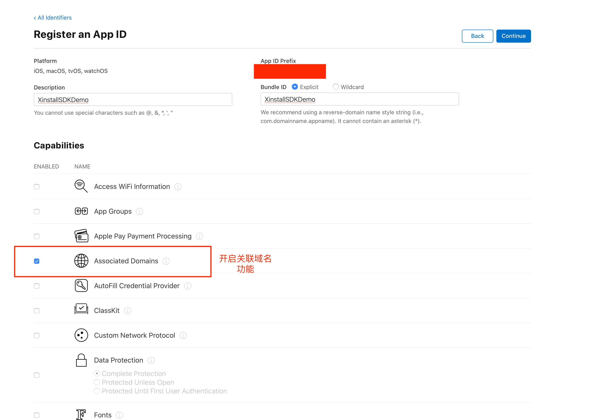

# Xinstall-Lua-SDK 配置

## iOS 平台配置

### 一、添加文件

将iOS目录下的`XinstallCocos2dx_Lua`文件夹拷贝到项目的 `ios` 文件目录下，然后在Xcode工程左侧目录里找到 `iOS`目录，右键 `Add File to xxx` 添加 `XinstallCocos2dx_Lua` 文件夹，add的时候注意勾选 `Copy items if needed`、`Create groups`

### 二、相关配置

#### 1. 初始化配置

在`Xinstall`官网注册好账号后，创建好App后，在项目中的Info.plist文件配置appKey键值对，具体如下

```xml
<key>com.xinstall.APP_KEY</key>
<string>Xinstall创建的项目的AppKey,由Xinstall官网你的控制后台获得</string>
```

#### 2. 接入SDK

1. 在项目的 `AppController.mm` 文件夹中加入头文件 

```objective-c
#import "XinstallLuaSDK.h"
```

2. 在方法 `- (BOOL)application:(UIApplication *)application didFinishLaunchingWithOptions:(NSDictionary *)launchOptions` 中加入方法

```objective-c
- (BOOL)application:(UIApplication *)application didFinishLaunchingWithOptions:(NSDictionary *)launchOptions {
    // cocos2dx 的方法-----
    .....
    // Xinstall Lua SDK 接入
    [XinstallLuaSDK init];
    return YES;
}
```

3. **Universal Links** 配置

   首先，我们需要到[苹果开发者网站](https://developer.apple.com/)，为当前的App ID开启关联域名(Associated Domains)服务：

   

   为刚才开发关联域名功能的AppID**创建**新的（或更新现有的）**描述文件**，下载并导入到XCode中(通过xcode自动生成的描述文件，可跳过这一步)：
   
   
   
   在XCode中配置Xinstall为当前应用生成的关联域名(Associated Domains)---**具体可以在Xinstall的控制台中找到**，类似applinks:xxxxxxx.xinstall.top
   
   
   
   **而后**我们在AppDelegate中添加**Univeral Link** 调起App的回调方法
   
   ```objective-c
   - (BOOL)application:(UIApplication *)application continueUserActivity:(NSUserActivity *)userActivity restorationHandler:(void (^)(NSArray * _Nullable))restorationHandler{
     //判断是否通过Xinstall Universal Link 唤起App
     if ([XinstallLuaSDK  continueUserActivity:userActivity]){
       //如果使用了Universal link ，此方法必写
       return YES;
     }
     //其他第三方回调；
     return YES;
   }
   ```

4. **Scheme** 配置

   `在 `AppController.mm` 中添加 **Scheme** 回调的方法

   ```objective-c
   // iOS9以上会优先走这个方法
   - (BOOL)application:(UIApplication *)app openURL:(NSURL *)url options:(NSDictionary<UIApplicationOpenURLOptionsKey,id> *)options {
   	// 处理通过Xinstall URL SchemeURL 唤起App的数据
   	[XinstallLuaSDK handleSchemeURL:url];
   	return YES;
   }
   
   // iOS9一下调用这个方法
   - (BOOL)application:(UIApplication *)application openURL:(NSURL *)url sourceApplication:(nullable NSString *)sourceApplication annotation:(id)annotation {
   	// 处理通过Xinstall URL SchemeURL 唤起App的数据
   	[XinstallLuaSDK handleSchemeURL:url];
   	return YES;
   }
   ```

## Android平台配置

### 一、拷贝文件

1. 将Android目录下的两个java文件拷贝到`app/src`目录下
2. 将Android目录下的aar的包拷贝到项目的`app/libs`目录下

### 二、添加权限

在 `AndroidManifest.xml ` 中添加 **Xinstall** 需要的网络权限

```xml
<uses-permission android:name="android.permission.INTERNET"/>
<uses-permission android:name="android.permission.ACCESS_NETWORK_STATE"/>
```

### 三、配置AppKey和scheme

同样在 `AndroidManifest.xml` 中添加 标签

```xml
<meta-data android:name="com.xinstall.APP_KEY" android:value="Xinstall_APPKEY"/>
```

### 四、拉起配置

1. 将Cocos2dx项目中`AppActivity`继承 **Xinstall ** 提供的 **XInstallActivity**（就是前面拷贝的两个文件）

2. 在`AndroidManfest.xml`中给 `AppActivity` 添加 

   ```xml
   android:launchMode="singleTask"
   ```

   以及配置`scheme`

   ```xml
   <data android:scheme="xixxxxx"/>
   // 从Xinstall控制台获得scheme
   ```

   最后配置大致未

   ```xml
   <activity
               android:name="org.cocos2dx.lua.AppActivity"
               android:screenOrientation="landscape"
               android:configChanges="orientation|keyboardHidden|screenSize"
               android:label="@string/app_name"
               android:theme="@android:style/Theme.NoTitleBar.Fullscreen"
               android:launchMode="singleTask"
               android:taskAffinity=""  >
               <intent-filter>
                   <action android:name="android.intent.action.MAIN" />
                   <category android:name="android.intent.category.LAUNCHER" />
               </intent-filter>
               <intent-filter>
                   <action android:name="android.intent.action.VIEW"/>
                   <category android:name="android.intent.category.DEFAULT"/>
                   <category android:name="android.intent.category.BROWSABLE"/>
   
                   <data android:scheme="XINSTALL_SCHEME"/>
               </intent-filter>
   
   </activity>
   ```

   **注：** 如果不想继承Xinstall的Activity类，可以将Activity中的方法加到**AppActivity**里

## Lua 使用指南

### 一、配置

导入 **xinstall.lua** 到文件工程中，并在调用的视乎使用一下代码引用：

```lua
local xinstall = require("src/ActionManagerTest/xinstall")
--- require 内为文件地址
```

如果只是使用基础班功能（无需携带参数安装、渠道统计、调起传参），直接以前的配置就行了。

### 二、使用

#### 1. 拉起传参

完成相关iOS 和 Android的一键拉起的配置

然后在app启动后的第一个scence 中 获取参数

```lua
local function wakeUpCallBack(result)
    print("拉起参数回调："..result)
end

xinstall:registerWakeUpHandler(wakeUpCallBack)
```

#### 2. 携带参数安装

```lua
local function getInstallCallBack(result)
    print("安装参数回调："..result)
end
// 此处第一个参数为网络请求过期时间，只有android 有效，iOS 未提供。
xinstall:getInstance(10,getInstallCallBack)
```

#### 3. 渠道统计相关

##### 3.1 注册上报

```lua
xinstall:reportRegister()
```

##### 3.2 事件点上报

注：需要在官网控制台内注册效果点进行统计，只为某些特殊业务的效果点进行统计

```lua
xinstall:reportEventPoint("123",25)
```

## 导出apk/ipa包并上传

参考官网文档

[iOS集成-导出ipa包并上传](https://doc.xinstall.com/integrationGuide/iOSIntegrationGuide.html#四、导出ipa包并上传)

[Android-集成](https://doc.xinstall.com/integrationGuide/AndroidIntegrationGuide.html#四、导出apk包并上传)

## 如何测试功能

参考官方文档 [测试集成效果](https://doc.xinstall.com/integrationGuide/comfirm.html)

## 更多 Xinstall 进阶功能

若您想要自定义下载页面，或者查看数据报表等进阶功能，请移步 [Xinstall 官网](https://xinstall.com) 查看对应文档。

若您在集成过程中如有任何疑问或者困难，可以随时[联系 Xinstall 官方客服](https://admin.qidian.qq.com/template/blue/mp/menu/qr-code-jump.html?linkType=0&env=ol&kfuin=2355021609&fid=350&key=4576bf1f33461342433de54b612d61a0&cate=1&type=16&ftype=1&_type=wpa&qidian=true) 在线解决。


